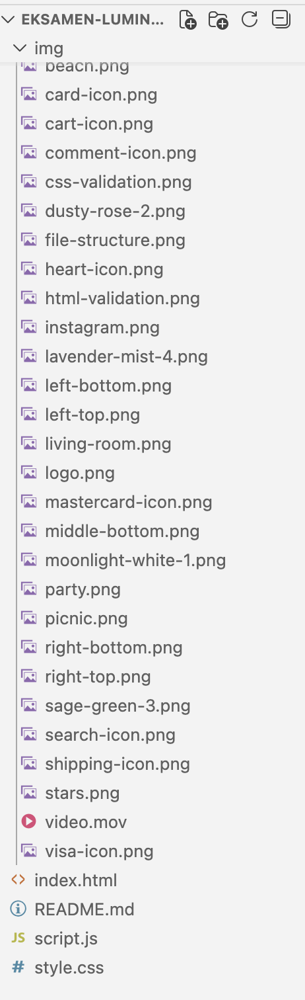
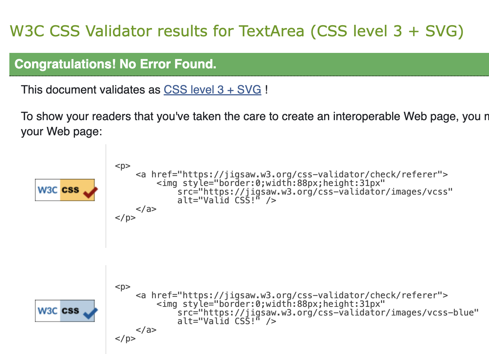

# Programmerings-dokumentation

## Kort beskrivelse af projektet

- Dette projekt er udviklet som eksamensprojekt på Multimediedesigneruddannelsens 1. semester.

- Formålet med projektet var at redesigne og udvikle en landingpage til den fiktive højtaler Lumina One med fokus på UX, UI-design og frontendudvikling.
- Projektet er udviklet med: 
    - HTML5, CSS3, JavaScript, Figma

Landingpagen giver brugeren mulighed for at: 
- Udforske produktets funktioner
- Se produktets specifikationer
- Skifte mellem forskellige farvevarianter
- Læse anmeldelser
- Se inspirationsindhold fra Instagram
- Navigere rundt på siden via intern navigation    


## Fil og mappestruktur

**index.html**
- Indeholder sidens struktur og indhold.
- Her opbygges navigation, hero-sektion, produktinformation, anmeldelser, Instagram-sektion og footer.

**style.css**
- Indeholder al styling af landingpagen.
- Styrer farver, typografi, spacing, layout, animationer og responsive tilpasninger.

**script.js**
- Indeholder sidens JavaScript-funktionalitet.
- Styrer blandt andet farvevælgeren, hvor produktbillede og beskrivelse opdateres dynamisk ved brugerinteraktion.

**img-mappen**
- Indeholder alle billeder og ikoner, som anvendes på landingpagen.
- Eksempelvis produktbilleder, hero-billede, Trustpilot-ikoner og øvrige grafiske elementer.




### Hvorfor har jeg valgt denne struktur?

Projektet er opdelt i separate filer og mapper for at skabe en overskuelig og vedligeholdelsesvenlig kodebase.

Ved at adskille HTML, CSS, JavaScript og billeder bliver projektet lettere at navigere i, fejlfinde og videreudvikle. Strukturen følger almindelig praksis inden for frontendudvikling og gør det nemmere at samarbejde med andre udviklere.


## Validering af CSS

Jeg har valideret projektets CSS-fil:

- style.css

Jeg har anvendt **W3C CSS Validator** til at validere CSS-koden.

Valideringen viste ingen fejl eller advarsler.

Eventuelle fejl blev løbende rettet under udviklingen, indtil CSS-koden kunne valideres uden fejl.

### Dokumentation


### Validering af HTML
Jeg har valideret projektets HTML-fil:

- index.html

Jeg har anvendt **Nu HTML Checker (W3C HTML Validator)** til at validere HTML-koden.

Valideringen viste ingen fejl.

Der blev vist én advarsel om dokumentstrukturen, da validatoren anbefaler, at alle `<section>`-elementer indeholder en overskrift af hensyn til semantik og tilgængelighed.

Eventuelle fejl blev løbende rettet under udviklingen i Visual Studio Code, indtil HTML-koden kunne valideres uden fejl.


### Dokumentation


## JavaScript datastruktur

Jeg har arbejdet primært med tekstdata (strings) og elementsamlinger hentet med querySelectorAll(), querySelector() og getElementById().

Jeg har blandt andet anvendt en NodeList med alle farveknapperne, som gemmes i variablen colorBars. Ved hjælp af forEach() gennemløbes elementerne, så brugeren kan klikke på dem og ændre produktbillede og beskrivelse.

Farveknapperne indeholder desuden data-attributterne data-color og data-text, som JavaScript henter med getAttribute(). Disse værdier bruges til at opdatere indholdet dynamisk, når brugeren vælger en ny farve.

Jeg arbejder også med forskellige DOM-elementer til produktspecifikationer, anmeldelser og nyhedsbrevstilmelding, hvor JavaScript reagerer på brugerens handlinger gennem event listeners.

Denne datastruktur passer godt til projektet, fordi den gør det nemt at håndtere flere interaktive elementer på én gang uden at skrive den samme kode flere gange.


**Eksempel på JavaScript koden**

```javascript
// FIND DIN PERSONLIGE FARVE

/* 
Pædagogisk pointe:
Vi henter alle farveknapperne, produktbilledet og tekstfeltet,
så vi kan opdatere indholdet, når brugeren vælger en ny farve.
*/

const colorBars = document.querySelectorAll('.color-bar');
const mainProductImg = document.querySelector('#speakerImage');
const colorDescriptionText = document.querySelector('#colorDescription');

colorBars.forEach(bar => {
    bar.addEventListener('click', () => {

        /*
        Pædagogisk pointe:
        Først fjerner vi den aktive klasse fra alle farver,
        så kun én farve kan være valgt ad gangen.
        */
        colorBars.forEach(b => b.classList.remove('active'));

        // Marker den valgte farve som aktiv
        bar.classList.add('active');

        /*
        Pædagogisk pointe:
        Henter billedstien fra data-color attributten.
        Hvis der findes et billede, opdateres produktbilledet.
        */
        const newImgSrc = bar.getAttribute('data-color');

        if (newImgSrc) {
            mainProductImg.src = newImgSrc;
        }

        /*
        Pædagogisk pointe:
        Henter den tekst, der hører til den valgte farve.
        Hvis teksten findes, opdateres beskrivelsen på siden.
        */
        const newText = bar.getAttribute('data-text');

        if (newText && colorDescriptionText) {
            colorDescriptionText.textContent = newText;
        }
    });
});
```
